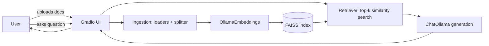

# RAG Study Assistant

A local, fully offline Retrieval-Augmented Generation (RAG) chatbot for studying from your own documents (PDF, `.txt`, `.docx`). No document content or questions are ever sent to an external API. All embedding and generation runs through a locally hosted [Ollama](https://ollama.com/) server.

## Features

- Upload PDF, Word (`.docx`) or plain text study documents through a Gradio web UI.
- Documents are chunked (512 characters / 64 overlap by default) and embedded locally with `nomic-embed-text`, then indexed with FAISS for fast similarity search.
- Answers are generated with a local Llama 3 8B model via Ollama, grounded strictly in the retrieved excerpts.
- Every answer includes a `Source: [filename], page [n]` citation.
- Short-term conversation memory (last 4 turns / ~1500 tokens) allows natural follow-up questions.
- A TruLens-based evaluation harness scores the RAG Triad (Groundedness, Answer Relevance, Context Relevance) across multiple chunk sizes, using a local Ollama model as the judge.

## Architecture



## Prerequisites

1. Install [Ollama](https://ollama.com/) and start the server (`ollama serve` runs by default on `http://localhost:11434`).
2. Pull the required models:
   ```powershell
   ollama pull llama3:8b
   ollama pull nomic-embed-text
   ```
3. Python 3.11.

## Setup

```powershell
python -m venv .venv
.\.venv\Scripts\Activate.ps1
pip install -r requirements.txt
copy .env.example .env
```

Adjust `.env` if your Ollama server, models, or chunking parameters differ from the defaults.

## Running the app

```powershell
python main.py
```

This launches the Gradio UI (default `http://127.0.0.1:7860`). Upload one or more documents, wait for the "Indexed..." status message, then ask questions in the chat box.

## Running tests

Unit tests use lightweight fake embeddings/LLM implementations, so they run without a live Ollama server:

```powershell
pytest
```

## Running the chunk-size evaluation

1. Place representative sample documents in `data/sample_docs/`.
2. Run:
   ```powershell
   python -m evaluation.run_evaluation --sample-docs data/sample_docs
   ```
3. Results are written to `data/eval_results/chunk_size_comparison.csv` and `.png`, comparing Groundedness, Answer Relevance and Context Relevance across chunk sizes 256, 512 and 1024 characters. This requires Ollama to be running (the same local model is used as the judge via TruLens's LiteLLM provider).

## Project structure

```
src/rag_assistant/   application package (ingestion, indexing, memory, prompts, pipeline, ui)
evaluation/          TruLens RAG Triad evaluation harness and test question set
tests/                unit tests (offline, using fake embeddings/LLM)
data/                 sample documents, FAISS index storage, evaluation results (gitignored except .gitkeep)
```
